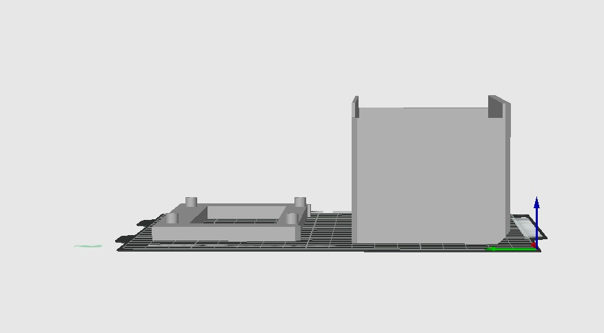

# Estação Híbrida de Monitoramento
### Monitoramento de Ar e Aquário com ESP8266

---

## Visão Geral
Estação de monitoramento inteligente baseada no **ESP8266 (Wemos D1 Mini)**, capaz de medir:

-  Temperatura e umidade do ar (DHT11)
-  Temperatura da água do aquário (DS18B20)
-  Hora e data (RTC + NTP)
-  Status de conexão WiFi

Todas as informações são exibidas em um **display LCD 20x4**.

---
## Conexões Elétricas

| Componente            | Pino do Componente | Pino no Wemos D1 Mini | Nota Importante                     |
| --------------------- | ------------------ | --------------------- | ----------------------------------- |
| **DS18B20 (Aquário)** | VCC (Vermelho)     | 3.3V                  | Resistor **4.7kΩ** entre VCC e DATA |
|                       | GND (Preto)        | GND                   | —                                   |
|                       | DATA (Amarelo)     | D3                    | Protocolo **OneWire**               |
| **DHT11 (Ar)**        | VCC                | 3.3V ou 5V            | Funciona em ambas tensões           |
|                       | GND                | GND                   | —                                   |
|                       | DATA               | D4                    | —                                   |
| **LCD 20x4 I2C**      | VCC                | 5V                    | Melhor contraste                    |
|                       | GND                | GND                   | —                                   |
|                       | SDA                | D2                    | Comunicação I2C                     |
|                       | SCL                | D1                    | Comunicação I2C                     |
| **RTC DS1302**        | VCC                | 5V ou 3.3V            | Depende do módulo                   |
|                       | GND                | GND                   | —                                   |
|                       | CLK                | D5                    | Clock                               |
|                       | DAT                | D6                    | Dados                               |
|                       | RST                | D7                    | Reset                               |

---

##  Galeria do Projeto
###  Case

  
  

###  Detalhes 

  
  

---

##  Componentes Utilizados

| Componente | Função |
|-----------|-------|
| Wemos D1 Mini (ESP8266) | Processamento e WiFi |
| Sensor DHT11 | Temperatura e umidade do ar |
| Sensor DS18B20 | Temperatura da água |
| Display LCD 20x4 I2C | Interface visual |
| RTC DS1302 | Data e hora |
| Resistor 4.7kΩ | Pull-up do DS18B20 |

---

##  Layout do Display LCD

| Linha | Conteúdo |
|-----|---------|
| Linha 1 |  Temp. do Ar +  Hora |
| Linha 2 |  Temp. da Água +  Data |
| Linha 3 |  Umidade (%) + Barra |
| Linha 4 | Conforto +  WiFi + Emoji |

---

##  Pinagem – Wemos D1 Mini

| Pino | Ligação |
|----|--------|
| D1 (SCL) | LCD I2C |
| D2 (SDA) | LCD I2C |
| D3 | DS18B20 (4.7kΩ → 3.3V) |
| D4 | DHT11 |
| D5 | RTC CLK |
| D6 | RTC DAT |
| D7 | RTC RST |

---

##  WiFi – Funcionamento Inteligente

| Recurso | Descrição |
|------|----------|
| AP Temporário | `ESTACAO_AQUARIO` |
| Portal Ativo | 60 segundos |
| Modo Offline | Funciona sem WiFi |
| Reconexão | A cada 10 segundos |

---

##  Análise de Conforto

###  Temperatura do Ar
| Estado | Faixa |
|-----|------|
| FRIO | < 16 °C |
| NORMAL | 16–29 °C |
| QUENTE | > 29 °C |

###  Umidade
| Estado | Faixa |
|-----|------|
| Muito seco | < 30% |
| Normal | 30–75% |
| Muito úmido | > 75% |

---

##  Arquivos STL – Impressão 3D

 **Local:** `Case3D/stl/`

| Arquivo | Descrição |
|------|----------|
| [`ArduBody.stl`](Case3D/stl/ArduBody.stl) | Corpo da estação |
| [`ArduLcdCover.stl`](Case3D/stl/ArduLcdCover.stl) | Moldura do LCD |

 Recomendações:
- Material: PLA ou PETG
- Infill: 20–30%
- Camada: 0.2 mm

---

##  Bibliotecas Necessárias

- DHT sensor library
- LiquidCrystal I2C
- Rtc by Makuna
- WiFiManager
- DallasTemperature
- OneWire

---

##  Instalação

1. Monte o hardware conforme a pinagem
2. Instale as bibliotecas
3. Grave o arquivo `sensor-temp.ino`
4. Ligue o sistema e configure o WiFi se desejar

---

##  Autor
**Moacir Pereira**  
 Eletrônica • Automação • Impressão 3D
