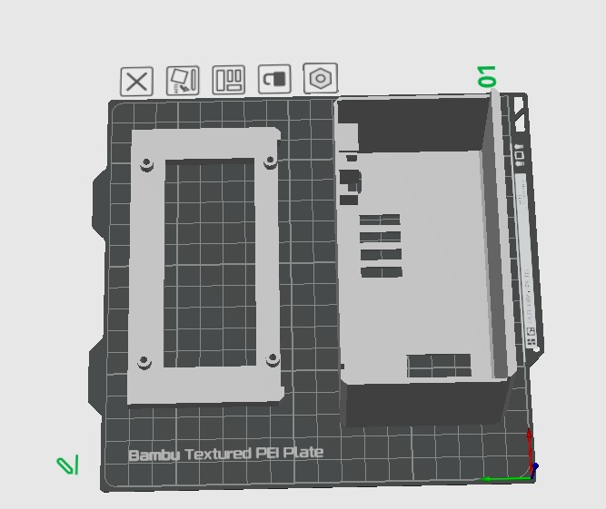
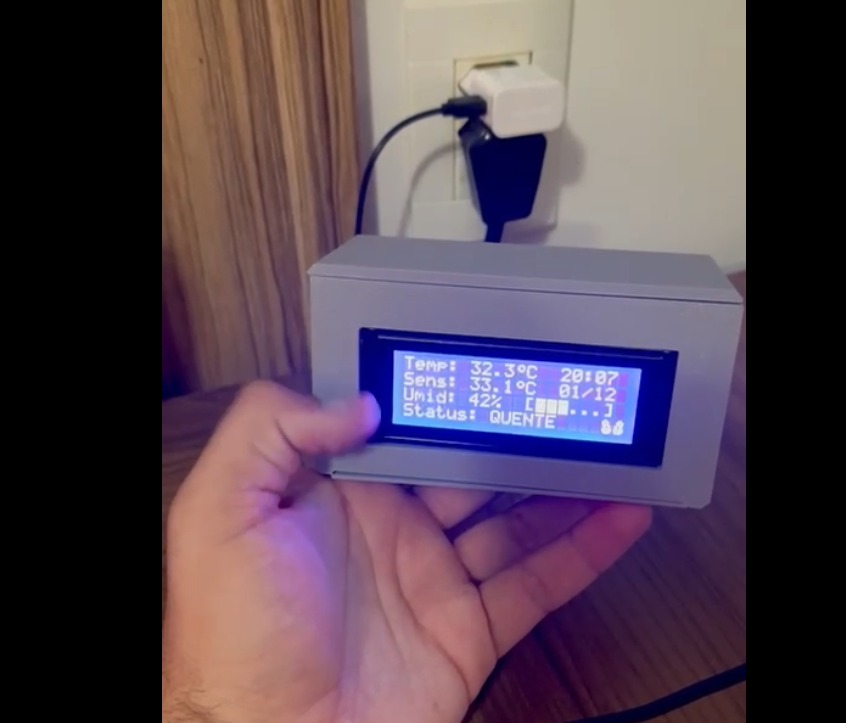
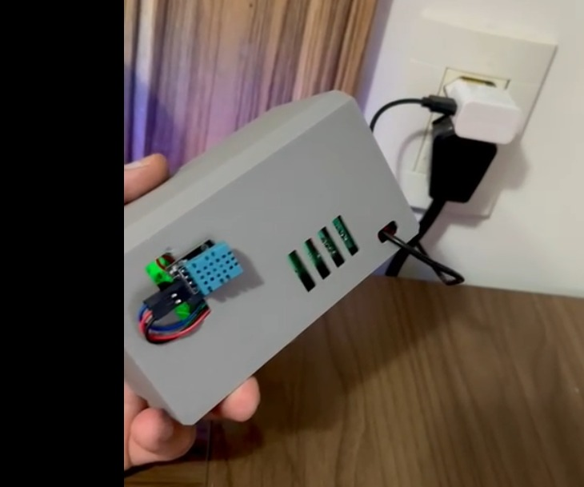

# Estação de Monitoramento de Ambiente com ESP8266

Projeto de uma estação meteorológica compacta baseada em ESP8266, com display LCD 20x4, que monitora temperatura, umidade e sensação térmica. O sistema sincroniza a hora via NTP e a mantém com um módulo RTC, garantindo funcionamento autônomo após a configuração inicial.

## Funcionalidades

- **Monitoramento:** Temperatura, umidade, e cálculo de sensação térmica.
- **Análise de Conforto:** Classifica o ambiente como Ideal, Frio, Quente, Úmido ou Seco.
- **Relógio:** Data e hora atualizadas via NTP e mantidas por um RTC (DS1302).
- **Conectividade:** Configuração de rede simplificada via WiFiManager.
- **Eficiência:** O WiFi é desativado após a sincronização para economizar energia.
- **Display:** Interface clara em um LCD 20x4 com atualizações constantes.

---

## Hardware

### Componentes Necessários

| Componente              | Quantidade | Observações                |
| ----------------------- | ---------- | -------------------------- |
| Wemos D1 Mini (ESP8266) | 1          | Microcontrolador com Wi-Fi |
| Sensor DHT11            | 1          | Medidor de temperatura e umidade |
| LCD 20x4 I2C            | 1          | Endereço I2C padrão: `0x27` |
| Módulo RTC DS1302       | 1          | Relógio de tempo real      |
| Bateria CR2032          | 1          | Para alimentar o RTC       |
| Jumpers                 | ~12        | Para as conexões           |

### Montagem e Conexões

**Sensor DHT11**
| Pino | Wemos D1 Mini |
| ---- | ------------- |
| VCC  | 5V            |
| GND  | GND           |
| DATA | D4 (GPIO2)    |

**Display LCD I2C**
| Pino | Wemos D1 Mini |
| ---- | ------------- |
| VCC  | 5V            |
| GND  | GND           |
| SDA  | D2 (GPIO4)    |
| SCL  | D1 (GPIO5)    |

**Módulo RTC DS1302**
| Pino | Wemos D1 Mini |
| ---- | ------------- |
| VCC  | 5V            |
| GND  | GND           |
| CLK  | D5 (GPIO14)   |
| DAT  | D6 (GPIO12)   |
| RST  | D7 (GPIO13)   |

---

## Case para Impressão 3D

Uma case foi modelada para acondicionar os componentes, conferindo um acabamento limpo e profissional ao projeto.

### Imagens

| Vista 3D                               | Componentes Montados                   | Projeto Finalizado                     |
| :------------------------------------: | :------------------------------------: | :------------------------------------: |
|  |  |  |

### Arquivos de Impressão

Os arquivos `.stl` para impressão 3D estão localizados na pasta `/Case3D/stl`:
- `case_base.stl`: Corpo principal da case.
- `tampa.stl`: Tampa traseira.

---

## Configuração do Software

### Bibliotecas para Arduino IDE

Instale as seguintes bibliotecas através do "Library Manager":
- `DHT sensor library` por Adafruit
- `Adafruit Unified Sensor` (dependência da biblioteca DHT)
- `LiquidCrystal I2C` por Frank de Brabander
- `Rtc by Makuna`
- `WiFiManager` por tzapu

### Configurações da Placa

- **Placa:** LOLIN(WEMOS) D1 R2 & mini
- **Flash Size:** 4MB (FS: 1MB OTA: ~1019KB)
- **Porta:** Selecione a porta COM correspondente ao seu Wemos D1 Mini.

### Instruções de Uso

1.  **Primeira Inicialização:**
    - Ao ser ligado, o dispositivo criará um ponto de acesso Wi-Fi chamado **"ESTACAO-IOT"** (senha: `12345678`).
    - Conecte-se a esta rede e acesse `192.168.4.1` em um navegador.
    - Selecione sua rede Wi-Fi local e insira a senha.
    - O sistema irá sincronizar a hora via NTP, gravá-la no RTC e desligar o Wi-Fi.

2.  **Ajuste Manual do RTC (Opcional):**
    - Se precisar definir a hora manualmente, descomente o seguinte trecho no `setup()` do código:
      ```cpp
      // RtcDateTime manual(2024, 11, 27, 16, 00, 00); // Ano, Mês, Dia, Hora, Min, Seg
      // rtc.SetDateTime(manual);
      ```
    - Faça o upload do código, e depois comente as linhas novamente e faça o upload mais uma vez para retornar ao modo de operação normal.

---

## Detalhes de Funcionamento

### Layout do Display

| Linha | Conteúdo (Coluna 0-19)                                     |
| :---: | ---------------------------------------------------------- |
|   1   | `Temp: 25.5°` e `14:35`                                    |
|   2   | `Sens: 26.3°` e `27/11`                                    |
|   3   | `Umid: 65%` e uma barra de progresso gráfica               |
|   4   | `Status: IDEAL`                                            |

### Critérios de Conforto Térmico

| Condição | Temperatura | Umidade | Status no Display |
| :--- | :--- | :--- | :--- |
| **Frio** | < 16°C | - | `FRIO` |
| **Quente** | > 29°C | - | `QUENTE` |
| **Seco** | - | < 30% | `MTO SECO` |
| **Úmido** | - | > 75% | `MTO UMIDO` |
| **Ideal** | 18-26°C | 40-60% | `IDEAL` |
| **Normal** | Outros casos | - | `NORMAL` |

---

## Solução de Problemas

- **Display não liga:** Verifique as conexões SDA/SCL, o endereço I2C e o contraste do LCD.
- **Erro no sensor DHT:** Certifique-se de que o pino de dados está conectado a D4 e que há um intervalo de 2 segundos entre as leituras.
- **RTC não salva a hora:** Verifique a bateria CR2032 e as conexões CLK/DAT/RST.
- **Portal Wi-Fi não aparece:** Pressione o botão de reset ou utilize a função `wm.resetSettings()` no código para forçar a reconfiguração.

---

## Autor

**Moacir Pereira**
- Projeto pessoal de automação e monitoramento de ambiente.
- Atualizado em: Novembro de 2024.

## Licença

Este projeto é distribuído sob a licença MIT. Sinta-se à vontade para usar, modificar e compartilhar.
